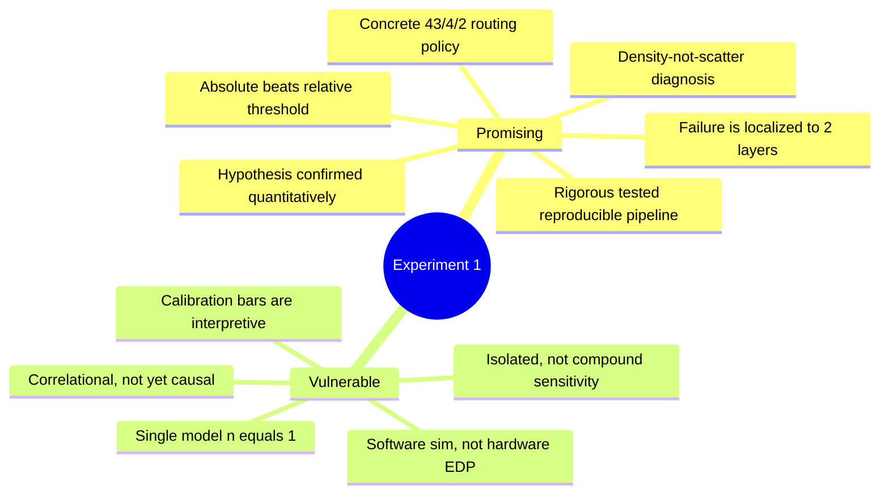

# Meeting 1 W/ Nazim:  ViT-B/16 PTQ for Edge Deployment
---

## 0. One-paragraph "where we are"

We set out to test whether `LLM.int8()` mixed-precision quantization, the
standard approach for serving large language models on constrained hardware, is
the right tool for a Vision Transformer (`ViT-B/16`) bound for a Jetson Orin
Nano. We built a rigorous, fully-tested measurement pipeline (Experiment 1) and
ran it over the full 50,000-image ImageNet-1K validation set. The headline
result is in: **a global `LLM.int8()` policy is the wrong choice for ViT-B/16,
and a per-layer (heterogeneous) routing policy is demonstrably better.** The
remaining three experiments (granularity, sensitivity, decomposition) are
designed but not yet run.

---

## 1. The research question and the intended novel contribution

### The friction points from literature

- INT8 GEMMs (via cuBLAS) are efficient but **activation outliers wreck
  accuracy**. This is the core finding of Dettmers et al., *LLM.int8()*
  (2022).
- `LLM.int8()` solves it by **routing entire outlier feature columns to FP16**
  and computing the rest in INT8. This works because LLM outliers are
  **sparse** and **channel-persistent**: a handful of feature dimensions are
  reliably large across all tokens.

### Hypothesis

> The sparsity and persistence assumptions that justify `LLM.int8()` were derived
> from *language* models. Vision Transformers may have a **different outlier
> topology**: denser, and concentrated in feedforward layers. If so, applying
> `LLM.int8()` globally to a ViT would push the majority of compute to FP16,
> destroying the EDP (Energy-Delay Product) benefit that is the entire point of
> edge quantization.

### The proposed contribution

Rather than accept or reject `LLM.int8()` wholesale, we propose a
**heterogeneous (selective) routing policy**: characterize every linear layer
independently and assign each its own precision regime (pure INT8, `LLM.int8()`
mixed, or pure FP16). Experiment 1 is the **decision engine** that produces this
policy directly from measured data.

The question for the advisor: *is "a per-layer routing policy derived from a
measured outlier map" a defensible novel contribution, or is this established
practice that just needs citing?* (See §7, open questions.)

---

## 2. Design choices, and why they are grounded

These are the methodological decisions baked into `src/hooks.py` and
`run_experiment1_mapping.py`. Each one should be ready to defend.

| Decision | What we did | Why (grounding) |
|---|---|---|
| **Measure matmul inputs, not outputs** | Forward **pre-hooks** on every `nn.Linear`, characterizing `X` in `Y = X @ Wᵀ` | `LLM.int8()` inspects `X` and routes columns of `X`. The input is the exact decision point. The output is a tensor the quantizer never routes on. |
| **timm ViT, not torchvision** | `vit_base_patch16_224` from `timm` | torchvision's fused `nn.MultiheadAttention` hides the attention projections (only 37 hookable modules). `timm` exposes all **49 linear projections** as independent `nn.Linear`s. |
| **Two-pass exact algorithm** | Pass 1 computes exact per-channel mean/std. Pass 2 freezes them and counts outliers. | The 3σ threshold depends on statistics only known after seeing all data. Reading data twice is the cost of an exact cutoff instead of a per-batch approximation. |
| **Per-channel (not global) 3σ** | Each of the 768 / 3072 input features gets its own mean and std. | A tight-variance channel and a wide-variance channel must not share one bar. This is the natural complement to `LLM.int8()`'s per-column decision. |
| **Chan/Welford merge in float64** | Numerically stable parallel variance merge. | Avoids catastrophic cancellation over 9.85M tokens per layer. Exact to floating-point round-off. |
| **Per-column routing fraction as the PRIMARY metric** | Flag a column as routed only if it exceeds the threshold in at least a minimum fraction of tokens. | `LLM.int8()` is structured: cuBLAS forces whole-column routing, never scattered scalars. The per-column fraction is the true share of the contraction dimension pushed to FP16. |
| **Two participation bars** | 25% for the fixed `\|x\|>6.0` bar. 5% for the 3σ bar. | 25% is the faithful `LLM.int8()` criterion. ViT's ~1% per-channel density means a 25% bar flags zero columns on the 3σ threshold (true but uninformative). 5% still demands persistence (~492K of 9.85M tokens) but yields a usable signal. |
| **Strict memory discipline** | Statistics computed on-the-fly. Raw activations never stored. | 8 GB VRAM budget (RTX 3070 dev box). Per-layer accumulators are ~12 KB, not gigabytes of cached tensors. |

**Talking point:** each of these is a deliberate trade-off. The two that are
most our own design (and most worth a sanity check from the advisor) are the
**per-column structured routing fraction** and the **dual participation bars**.
Both are interpretive choices, not direct quotations from the paper.

---

## 3. Experiment 1 findings (the good news that shows promise)

*Source: `outputs/exp1_outlier_maps/REPORT.md`, `outlier_stats.json`, and the
PNG charts. Run: 50,000 ImageNet-1K val images, 9.85M tokens/layer.*

### Finding 1: The hypothesis is confirmed, quantitatively

ViT-B/16's INT8-breaking outliers are **real, dense, and concentrated in
feedforward up-projections**, exactly as hypothesized. The MLP `fc1` table:

| Block | Input σ | Max \|x\| | Per-value density (6.0) | **Routing fraction (6.0)** | Policy |
|------:|--------:|----------:|------------------------:|---------------------------:|:--|
| 0–7 | 0.88 → 1.42 | 24–47 | < 0.4% | ≤ 0.39% | 🟢 INT8 |
| **8** | **3.47** | **72.9** | **5.84%** | **3.78%** | 🟡 LLM.int8 |
| **9** | **7.32** | **104.8** | **35.0%** | **97.53%** | 🔴 FP16 |
| **10** | **13.43** | **202.7** | **61.23%** | **99.74%** | 🔴 FP16 |
| 11 | 1.53 | 29.3 | 0.22% | 0.26% | 🟢 INT8 |

The block-10 per-value density of **61.2%** lands almost exactly on the
project's preliminary "up to 63% in late blocks" estimate. *(These fixed-6.0
numbers are confirmed against the raw JSON: `blocks.9.mlp.fc1` = 0.97526,
`blocks.10.mlp.fc1` = 0.99740.)*

### Finding 2: The failure is localized, which makes it actionable

The catastrophe is a **transient residual-stream scale explosion** confined to
two layers:

```
Block:     0     1     2     3     4     5     6     7  |  8      9      10     11
σ (fc1):  0.88  0.94  0.89  0.97  1.06  1.12  1.21  1.42 | 3.47   7.32  13.43   1.53
```

σ detonates at blocks 8–10, peaks at max |x| = 202.7, then **collapses back to
1.53 at block 11**. This is the documented "massive activations" phenomenon.
Because it is confined, a **surgical 2-layer FP16 patch contains the entire
problem**. We do not need to abandon INT8 for the whole network.

### Finding 3: The map yields a concrete, defensible routing policy

The headline deliverable: **41 of 48 block-internal matmuls can run in pure
INT8 with negligible loss.**

- 🔴 **FP16: 2 layers**: `blocks.9.mlp.fc1`, `blocks.10.mlp.fc1` (routing ≈
  100%. `LLM.int8()` degenerates to FP16 plus overhead.)
- 🟡 **`LLM.int8()`: 4 layers**: `blocks.8.mlp.fc1` (3.78%), and
  `blocks.{3,5,6}.attn.qkv` (~0.5–0.8%). Sparse, column-persistent, favorable
  gap.
- 🟢 **INT8: 43 layers**: routing fraction < 0.5%. All `attn.proj` are
  essentially pristine (≈0% density). All `mlp.fc2` are sparse.

### Finding 4: The two metrics together diagnose why a layer fails

The gap between per-value density and per-column routing fraction is itself the
diagnostic:

| Layer | Density | Routing | Direction | Meaning |
|---|---:|---:|:--|:--|
| `blocks.8.mlp.fc1` | 5.84% | 3.78% | routing **<** density | Outliers concentrated. Routable. |
| `blocks.9.mlp.fc1` | 35.0% | 97.5% | routing **≫** density | Outliers everywhere. Not routable. |
| `blocks.10.mlp.fc1` | 61.2% | 99.7% | routing **≫** density | Every column is an outlier. `LLM.int8()` is equivalent to FP16. |

The **channel-persistence variance for blocks 9–10 is the highest in the model**
(1.75M and 1.15M in the JSON). The failure mode is **density, not scatter**.
`LLM.int8()`'s persistence assumption holds; its sparsity assumption fails. This
is a precise distinction worth publishing.

### Finding 5: Absolute (6.0) beats relative (3σ) for quantization safety

At σ = 13.4, the 3σ cutoff is ~40, so the relative threshold misses the
explosion entirely (it self-normalizes to the layer's own inflated scale). The
absolute 6.0 threshold, which maps to INT8's fixed dynamic range, correctly
flags the broken layers. The choice of threshold is not cosmetic, and we have
the data to show it.

### Engineering credibility (worth mentioning briefly)

- **Fully tested:** the suite verifies the outlier math against hand-computed
  tensors, plus plumbing (layer tagging, hooks, data loading, CLI). Per the
  project history, **43 tests pass** (42 fast + 1 slow real-model integration).
- **Reproducible and auditable:** exact per-channel `channel_means` and
  `channel_stds` are surfaced in the JSON so every threshold can be re-derived.
- **Stable estimates:** routing fractions for blocks 9–10 moved < 0.2 pp between
  the 4,096-image and 50,000-image runs. Converged.

---

## 4. Where it falls short (vulnerabilities to name early)

### 4.1 The biggest vulnerability: everything so far is correlational and software-only

Experiment 1 maps outliers. It does **not** yet show that the routing policy
preserves accuracy or improves EDP. The argument currently rests on the premise
that outlier topology predicts quantization damage. **That link is unvalidated
until Experiments 3 and 4 run.** This is the single most important caveat.

### 4.2 We measure simulation, not hardware EDP

The entire summer phase is **software accuracy simulation on an x86 GPU**.
Experiment 4 will not model the LPDDR5 memory-bandwidth penalty of gathering
scattered outlier columns on the Jetson. That penalty determines real EDP. There
is a genuine risk that a policy that looks good in simulation is worse on
hardware. We have documented this gap; we have not measured it.

### 4.3 Isolated vs. compound sensitivity

Experiment 3 (planned) quantizes **one layer at a time**. This captures
*intrinsic* sensitivity but not the compounding of quantization noise through
residual connections across 12 blocks. A layer that looks resilient in isolation
may fail in a fully-quantized stack. Our routing policy could be optimistic for
that reason.

### 4.4 Reporting inconsistency (resolved)

The codebase was hardened mid-stream to compute the 3σ threshold **per-channel**
(it was previously global). The JSON was regenerated with per-channel statistics,
but the prose tables in `REPORT.md` initially still reflected the old global
statistical-routing column. **This has been fixed.** `REPORT.md` was regenerated
from the current `outlier_stats.json` on 2026-06-30. All tables now show the
correct per-channel 3σ routing fractions (0.13% / 0.00% for blocks 9–10 fc1,
and effectively zero across all other layers). The fixed-6.0 headline numbers
were always correct and are unchanged.

### 4.5 Calibration choices are interpretive

The 5% statistical participation bar is calibrated to ViT's observed density,
not derived from first principles. That is a reasonable choice, but a reviewer
could call it post-hoc. We should frame it as a diagnostic lens (it answers
"which layers have persistent statistical outliers?"), separate from the
fixed bar which is the faithful `LLM.int8()` reproduction.

### 4.6 Scope is a single model

One architecture, one size (ViT-B/16). We cannot yet claim the pattern
generalizes to ViT-L, DeiT, Swin, or other vision transformers. The "massive
activations in late-middle blocks" finding is consistent with the literature,
which helps, but we have n = 1.

---

## 5. The good and the bad at a glance



---

## 6. Where we could pivot from here

Options to discuss, ordered roughly from "stay the course" to "biggest swing."

1. **Stay the course: run Experiments 3 then 4 to close the causal loop.**
   This is the natural next step and the highest-value one. Experiment 3
   (per-layer sensitivity) is the **cross-validation**: if the two largest
   accuracy-drop bars land on blocks 9–10 `fc1`, the outlier map is validated as
   a predictor and the routing-policy table becomes the thesis's primary
   deliverable. **Recommended default.**

2. **Pivot the framing toward "massive activations," not just `LLM.int8()`.**
   The localized σ-explosion is itself an interesting object. We could position
   the contribution around characterizing and surgically containing a transient
   residual-stream blow-up, with selective routing as the remedy. This leans
   into our most novel empirical finding.

3. **Tackle the root cause instead of routing around it.** Blocks 9–10 may be
   fixable with an equalization or smoothing technique (e.g. SmoothQuant-style
   migration of activation scale into weights, or per-channel weight
   equalization). If we can flatten the σ-explosion, those two layers might
   re-enter the INT8 regime. That would be a stronger result than "run them in
   FP16."

4. **Broaden to a second architecture for generalizability.** Re-run Experiment
   1 on ViT-L/16 or DeiT to test whether "FFN up-projection explosion in
   late-middle blocks" is a ViT-family pattern or a ViT-B/16 quirk. This is
   lower-risk and strengthens external validity, but does not advance the
   causal story.

5. **Bring hardware in early.** Move part of the Jetson Orin Nano measurement
   forward to ground the EDP claims that simulation cannot make. This has the
   highest real-world payoff but is a significant infrastructure lift for the
   summer window.

**Suggested ask of the advisor:** confirm option 1 as the immediate next step,
and get their read on whether option 2 or 3 is the more compelling thesis
framing once the causal loop is closed.

---

## 7. Open questions to put to the advisor

1. Is "a measured per-layer routing policy for ViT quantization" a strong enough
   novel contribution, or does it need pairing with a remedy (option 3)?
2. Are the two participation bars (25% / 5%) defensible, or should the
   statistical threshold be dropped from the headline and kept purely as a
   diagnostic?
3. How much does the simulation-vs-hardware EDP gap (§4.2) threaten the thesis
   if the hardware phase slips past the summer?
4. For Experiment 3, is isolated per-layer sensitivity acceptable as a first
   cut, or should we go straight to a compounding protocol?

---

## 8. Concrete next actions (post-meeting)

- [ ] Run **Experiment 3** (per-layer sensitivity) and check whether the
      accuracy-drop heatmap agrees with the outlier map at blocks 9–10 `fc1`.
- [ ] Run **Experiment 4** (decomposition). Confirm: fixed-6.0 leads to ~100%
      high-precision fraction on blocks 9–10 (no INT8 benefit). 3σ leads to
      ~0.4% (ineffective).
- [ ] Run **Experiment 2** (granularity) to quantify the per-tensor vs.
      per-token gap, predicted to be largest at blocks 9–10.
- [ ] Decide on pivot framing (§6) based on advisor feedback.

---

### Appendix: quick-reference figures

The following charts in `outputs/exp1_outlier_maps/` back the talking points:

- `routing_fraction_fixed.png`: the headline. Two spikes at blocks 9–10 fc1.
- `max_magnitude.png`: the 202.7 peak. Makes the scale explosion visual.
- `channel_persistence.png`: shows that outliers are persistent (not scattered).
- `value_outlier_density_fixed.png`: the unstructured baseline for the gap
  diagnostic.
- `routing_fraction_statistical.png` / `value_outlier_density_statistical.png`:
  the 3σ views.
