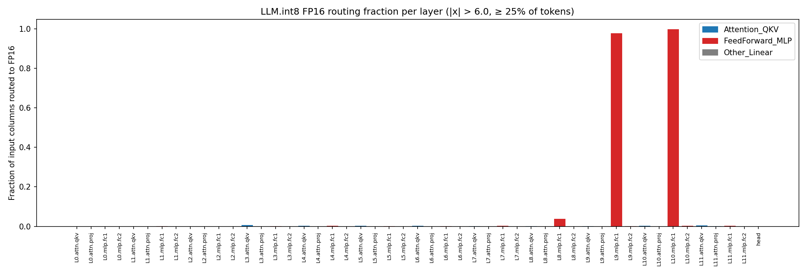
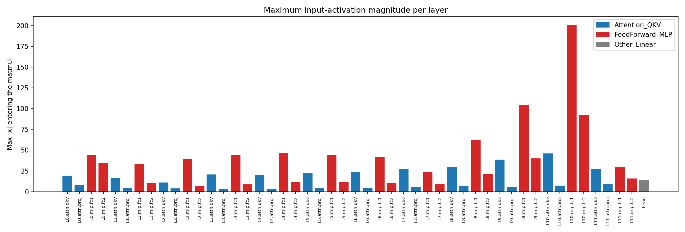
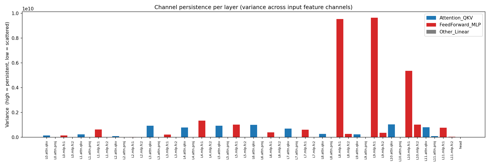
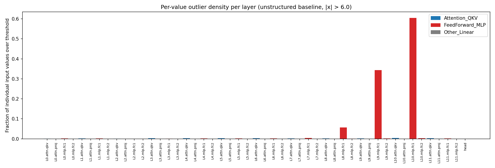
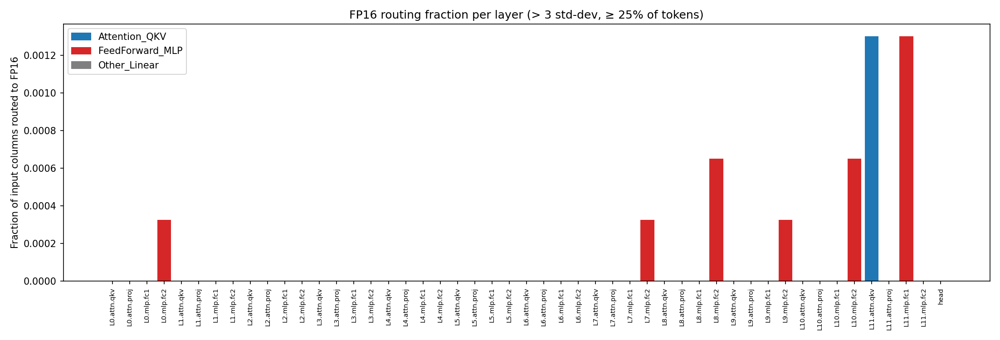
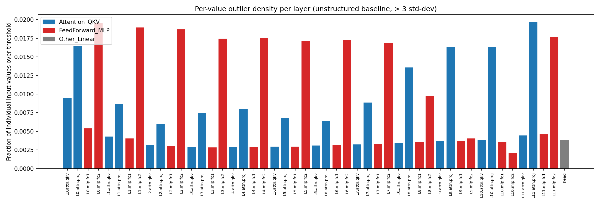
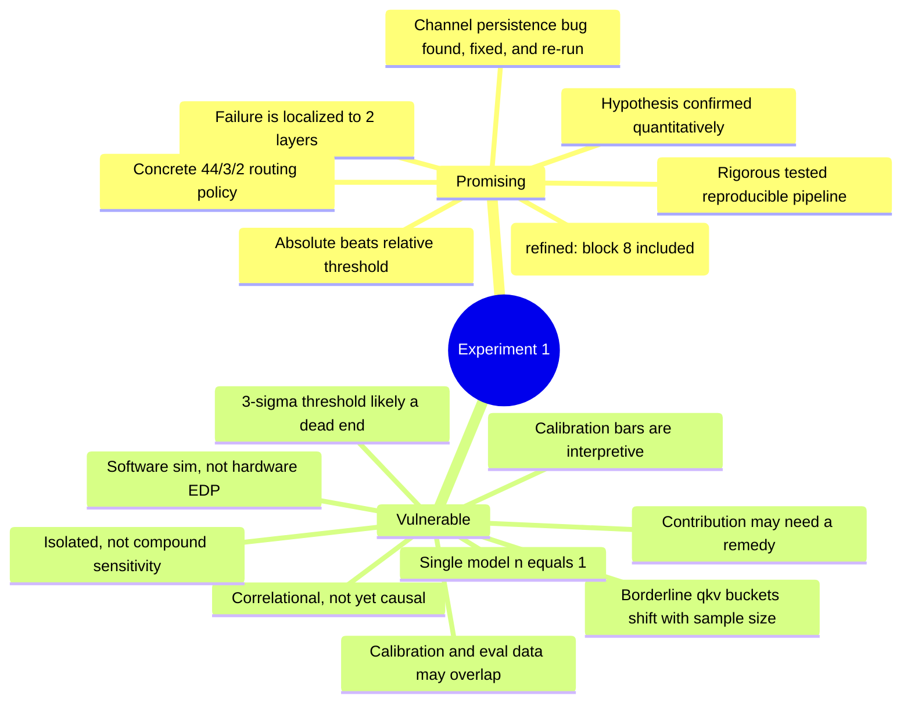

# Meeting 1 W/ Nazim:  ViT-B/16 PTQ for Edge Deployment
---

## 0. Status

We set out to test whether `LLM.int8()` mixed-precision quantization, the
standard approach for serving large language models on constrained hardware, is
the right tool for a Vision Transformer (`ViT-B/16`) bound for a Jetson Orin
Nano. We built a rigorous, fully-tested measurement pipeline (Experiment 1) and
ran it over a 5,000-image ImageNet-1K validation subset. ViT-B/16's outlier
topology is measurably different from the LLM topology `LLM.int8()` was
designed around, and the outlier map predicts a heterogeneous per-layer
routing policy. This prediction has not been validated against accuracy or
hardware EDP yet. That is the job of Experiments 3 and 4, which are designed
but not yet run. Section 4.1 below covers what is and is not proven at this
stage.

**Run size note:** earlier drafts of this document used a 50,000-image
thesis-print run. This revision reruns Experiment 1 on 5,000 images so the
pipeline (including the channel-persistence bug fix below) could be
re-validated quickly. All numbers, tables, and charts in this document now
come from the 5,000-image run unless marked otherwise. A full 50,000-image
thesis-print run should be redone before any number here is treated as final.

---

## 0.1 What to flag for Nazim

The items below are the ones worth spending meeting time on. Everything else
in this document is supporting detail; the full issue log is in Section 9.

1. **Is the contribution a method, or a measurement?** The current
   deliverable is a measured routing table for one model. Decide whether the
   thesis needs a remedy (e.g. activation smoothing for blocks 9-10) to stand
   as a strong contribution, or whether the measured policy plus causal
   validation is enough. (Section 1, Section 7 Q1)
2. **The borderline routing-policy buckets moved between the 50,000-image and
   5,000-image runs.** `blocks.5.attn.qkv` and `blocks.6.attn.qkv` dropped out
   of the LLM.int8() bucket (0.52% to 0.39%, now below the 0.5% cutoff) and
   `blocks.11.attn.qkv` entered it (0.39% to 0.52%). The two FP16 layers
   (blocks 9-10 fc1) did not move. This is new evidence, not a prediction: the
   policy table is sample-size sensitive at the margins. (Section 3.3, Section
   3 "Testing")
3. **The calibration data and the evaluation data are the same images.**
   Experiments 2-4 have not been implemented yet. Before they are, we need a
   decision on whether to hold out a separate evaluation split. (Section 4.7)
4. **Recommend dropping the 3-sigma threshold from Experiment 4.** It cannot
   detect the blocks 9-10 explosion by construction (it self-normalizes to
   each layer's own scale). Running the full decomposition sweep with it would
   mostly reconfirm what Section 3.5 already shows. (Section 4.5)
5. **A measurement bug was found and fixed during this review** (channel
   persistence variance was averaged across batches instead of computed once
   over the full run). The numbers in Section 3.4 are from the corrected code,
   but the fix changed the result meaningfully: block 8's persistence is now
   nearly as high as block 9's, despite a much lower routing fraction. Worth
   discussing what that means for the "density, not scatter" claim. (Section
   3.4, Section 4.8)

---

## 1. The research question and the intended novel contribution

### The friction point

- INT8 GEMMs (via cuBLAS) are efficient but **activation outliers wreck
  accuracy**. This is the core finding of Dettmers et al., *LLM.int8()*
  (2022).
- `LLM.int8()` solves it by **routing entire outlier feature columns to FP16**
  and computing the rest in INT8. This works because LLM outliers are
  **sparse** and **channel-persistent**: a handful of feature dimensions are
  reliably large across all tokens.

### Hypothesis

> The sparsity and persistence assumptions that justify `LLM.int8()` were derived
> from *language* models. Vision Transformers may have a **different outlier
> topology**: denser, and concentrated in feedforward layers. If so, applying
> `LLM.int8()` globally to a ViT would push the majority of compute to FP16,
> destroying the EDP (Energy-Delay Product) benefit that is the entire point of
> edge quantization.

### The proposed contribution

Rather than accept or reject `LLM.int8()` wholesale, we propose a
**heterogeneous (selective) routing policy**: characterize every linear layer
independently and assign each its own precision regime (pure INT8, `LLM.int8()`
mixed, or pure FP16). Experiment 1 is the decision engine that produces this
policy directly from measured data.

**[NEEDS ADVISOR INPUT]** As currently scoped, the deliverable of this
contribution is a measured 2/4/43 routing table for one model (Section 3.3).
That table is a defensible empirical characterization, but on its own it may
read as a diagnostic report rather than a novel method or algorithm - the
routing decision for each layer follows fairly directly from its routing
fraction once measured, without a new technique being introduced. This is
raised again, with options, in Section 7 ("Open questions," item 1) and
Section 6 ("Where we could pivot from here," option 3). Worth deciding early
whether the thesis needs a remedy/method (e.g., activation smoothing to fix
blocks 9-10 rather than route around them) to stand as a strong contribution,
or whether the measured policy plus causal validation (Experiments 3-4) is
sufficient on its own.

---

## 2. Design choices

These are the methodological decisions baked into `src/hooks.py` and
`run_experiment1_mapping.py`.

| Decision | What we did | Why (grounding) |
|---|---|---|
| **Measure matmul inputs, not outputs** | Forward **pre-hooks** on every `nn.Linear`, characterizing `X` in `Y = X @ Wᵀ` | `LLM.int8()` inspects `X` and routes columns of `X`. The input is the exact decision point. The output is a tensor the quantizer never routes on. |
| **timm ViT, not torchvision** | `vit_base_patch16_224` from `timm` | torchvision's fused `nn.MultiheadAttention` hides the attention projections (only 37 hookable modules). `timm` exposes all **49 linear projections** as independent `nn.Linear`s. |
| **Two-pass exact algorithm** | Pass 1 computes exact per-channel mean/std. Pass 2 freezes them and counts outliers. | The 3σ threshold depends on statistics only known after seeing all data. Reading data twice is the cost of an exact cutoff instead of a per-batch approximation. |
| **Per-channel (not global) 3σ** | Each of the 768 / 3072 input features gets its own mean and std. | A tight-variance channel and a wide-variance channel must not share one bar. This is the natural complement to `LLM.int8()`'s per-column decision. |
| **Chan/Welford merge in float64** | Numerically stable parallel variance merge. | Avoids catastrophic cancellation over 9.85M tokens per layer. Exact to floating-point round-off. |
| **Per-column routing fraction as the PRIMARY metric** | Flag a column as routed only if it exceeds the threshold in at least a minimum fraction of tokens. | `LLM.int8()` is structured: cuBLAS forces whole-column routing, never scattered scalars. The per-column fraction is the true share of the contraction dimension pushed to FP16. |
| **Two participation bars** | 25% for the fixed `\|x\|>6.0` bar. 5% for the 3σ bar. | 25% is the faithful `LLM.int8()` criterion. ViT's ~1% per-channel density means a 25% bar flags zero columns on the 3σ threshold (true but uninformative). 5% still demands persistence (~492K of 9.85M tokens) but yields a usable signal. |
| **Strict memory discipline** | Statistics computed on-the-fly. Raw activations never stored. | 8 GB VRAM budget (RTX 3070 dev box). Per-layer accumulators are ~12 KB, not gigabytes of cached tensors. |

### On the dual participation bars

The `LLM.int8()` paper uses a single persistence criterion: an input feature
column is flagged as an outlier column only when its magnitude exceeds the
threshold (6.0) in at least 25% of sequence positions. This makes sense for
LLMs, where outlier values are extreme (values of 60 or more) and a column that
ever crosses 6.0 almost certainly does so in the majority of tokens.

ViT-B/16 activations are different. The fixed-6.0 threshold is calibrated to the
INT8 dynamic range and works correctly for the quantization-safety question
(addressed at the 25% bar). But the 3σ statistical threshold produces values
that are moderate in magnitude and distributed roughly evenly across feature
columns: per-channel outlier density is only ~1%. Applying the 25% bar to the 3σ
threshold would flag zero columns on every layer, a result that is technically
correct (there are no LLM-style concentrated statistical outliers in ViT-B/16)
but that discards the diagnostic value of the statistical threshold entirely.
The 5% bar preserves the diagnostic question ("which layers have *persistent*
statistical outliers, even if spread out?") while still requiring far more than
a stray spike. At 5%, a column must exceed 3σ in roughly 492,000 of the
9,850,000 tokens seen in a full run.

The two bars therefore serve distinct purposes: the 25% bar answers "what would
`LLM.int8()` actually route?" (faithful reproduction), and the 5% bar answers
"which layers show any persistent deviation from per-channel normality?"
(research diagnostic).

---

## 3. Experiment 1 findings

*Run: 5,000 ImageNet-1K val images, 985K tokens/layer.*

### 3.1 The hypothesis is confirmed, quantitatively

ViT-B/16's INT8-breaking outliers are **real, dense, and concentrated in
feedforward up-projections**, exactly as hypothesized.

| Block | Input σ | Max \|x\| | Per-value density (6.0) | **Routing fraction (6.0)** | Policy |
|------:|--------:|----------:|------------------------:|---------------------------:|:--|
| 0–7 | 0.83 → 1.33 | 23–47 | < 0.4% | ≤ 0.26% | 🟢 INT8 |
| **8** | **3.06** | **62.3** | **5.72%** | **3.78%** | 🟡 LLM.int8 |
| **9** | **6.42** | **104.1** | **34.4%** | **97.66%** | 🔴 FP16 |
| **10** | **11.68** | **201.0** | **60.45%** | **99.74%** | 🔴 FP16 |
| 11 | 1.28 | 29.3 | 0.25% | 0.26% | 🟢 INT8 |

The block-10 per-value density of 60.5% lands close to the project's
preliminary "up to 63% in late blocks" estimate.



This chart shows the per-column routing fraction under the fixed 6.0 threshold
with the 25% participation bar, reported for all 49 linear layers in network
order. This is the primary metric: the fraction of input feature columns that
`LLM.int8()` would route to FP16. Every attention output projection (`attn.proj`,
orange bars) sits at zero. Most `attn.qkv` (blue) and `mlp.fc2` (green) layers
are near zero. The only visible signal is the two `mlp.fc1` spikes at blocks 9
and 10 (red), reaching 97.7% and 99.7%. The gap between these spikes and the
near-zero baseline everywhere else is the core empirical finding of this
experiment: the INT8-breaking problem is real but confined to two layers.

### 3.2 Transient residual-stream scale explosion

The catastrophe is a **transient residual-stream scale explosion** confined to
two layers:

```
Block:     0     1     2     3     4     5     6     7  |  8      9      10     11
σ (fc1):  0.87  0.85  0.83  0.89  0.97  1.04  1.15  1.33 | 3.06   6.42  11.68   1.28
```

σ detonates at blocks 8–10, peaks at max |x| = 201.0, then collapses back to
1.28 at block 11. This matches the documented "massive activations" phenomenon
in ViT's late-middle blocks. Because it is confined, a surgical 2-layer FP16
patch contains the entire problem. Abandoning INT8 for the whole network is not
necessary.

**Nuance on "transient":** *[FIXED, clarified, not a data change]* The rise is
not instantaneous at block 8. σ climbs gradually and monotonically from block 0
(0.87) to block 7 (1.33), a 1.5x increase over 7 blocks, then accelerates
sharply from block 7 to block 10 (1.33 → 11.68, an 8.8x increase in 3 blocks),
before collapsing 9.1x in a single block (11.68 → 1.28 at block 11). "Transient"
in this document refers specifically to the sharp collapse after the peak. The
buildup itself is gradual and may be diagnostically interesting on its own:
does the late-block attention pattern progressively concentrate mass into a
small set of tokens or channels before blocks 9–10? That question is related to
the high-norm-token artifacts described in Darcet et al., 2024 (discussed and
qualified in Section 4.9 below), but it is unconfirmed and remains open.

The residual stream in a ViT applies attention and the FFN **sequentially**,
not as two parallel additive terms to the same input. The correct form is:

```
x'_{i}   = x_i  + Attention(LN(x_i))
x_{i+1}  = x'_i + FFN(LN(x'_i))
```

*[FIXED: the original draft wrote this as a single expression,
`x_{i+1} = x_i + FFN(LN(x_i)) + Attention(LN(x_i))`, which incorrectly implies
the FFN and Attention sublayers both read the same input `x_i` in parallel. In
the standard ViT/Transformer block, the FFN's LayerNorm normalizes the
post-attention residual stream `x'_i`, not the original `x_i`. This matters
mechanistically: it means the fc1 input that explodes in blocks 9–10 already
includes whatever the attention sublayer deposited into the residual stream at
that block, not just the accumulated FFN history from earlier blocks.]*

LayerNorm normalizes each token's features to zero mean and
unit variance *before* the sublayer, but the output of the sublayer is added
back into the residual stream without normalization. In blocks 9–10, the FFN
`fc1` output escalates in magnitude (peak 201.0) and this scale is deposited
directly into the residual stream via the skip connection. The subsequent
LayerNorm at block 11 normalizes it back down. The explosion is produced by the
interaction of the FFN weights and the accumulated residual signal at those
specific depths, not by an external input. This is broadly consistent with the
"massive activations" literature - specifically Sun, Chen, Kolter & Liu,
"Massive Activations in Large Language Models," arXiv:2402.17762 (COLM 2024),
https://arxiv.org/abs/2402.17762, whose abstract states the authors also study
massive activations in Vision Transformers. *[FIXED: an earlier draft of this
section also cited Darcet et al., 2024 ("Vision Transformers Need Registers")
here. That paper's abstract describes high-norm **token-level** artifacts in
background image regions, not a feature-**channel**, depth-localized
activation-scale explosion of the kind measured here - a related but distinct
phenomenon. The citation has been removed from this sentence pending a closer
read of the full paper; see Section 4.9 for the full reasoning.]*



This chart shows the largest absolute activation value observed in each layer's
input across all 5,000 images and 985,000 tokens. Every `attn.proj`
(orange) stays under 12. Most `mlp.fc1` layers (red) in early blocks peak around
23–47. At blocks 9–10 the maximum explodes: 104.1 at block 9, 201.0 at block 10.
Block 11 recovers to 29.3. The explosion is confined to two layers and
disappears as abruptly as it arrives. This is a visual signature of the
"massive activations" phenomenon: the FFN output at a specific depth produces a
transient spike that dominates the dynamic range of the entire model.

### 3.3 The map yields a concrete, defensible routing policy

The headline deliverable: **42 of 48 block-internal matmuls, plus the `head`
layer (44 of all 49 measured layers), have a routing fraction low enough that
naive INT8 is predicted to be near-lossless.** *[FIXED: an earlier draft said
"41 of 48" in the prose while the policy table below summed to a different
INT8 count, a direct internal contradiction. The corrected count is
block-internal INT8 layers plus `head`, which was measured all along but never
written into the policy summary.]*

**Caveat on "near-lossless":** an earlier draft of this section said the
INT8-routed layers "can run in pure INT8 with negligible loss." That claim is
not supported by any accuracy measurement yet. Experiment 1 only measures
activation statistics, never a Top-1 accuracy number. The current, accurate
claim is: **these layers have a low enough routing fraction that we predict
they will tolerate naive INT8 with little accuracy loss.** Whether that
prediction holds is what Experiment 3 (per-layer sensitivity) is designed to
test, and it has not been run yet. See Section 4.1.

- 🔴 **FP16: 2 layers**: `blocks.9.mlp.fc1`, `blocks.10.mlp.fc1` (routing ≈
  100%. `LLM.int8()` degenerates to FP16 plus overhead.)
- 🟡 **`LLM.int8()`: 3 layers**: `blocks.8.mlp.fc1` (3.78%),
  `blocks.3.attn.qkv` (0.78%), `blocks.11.attn.qkv` (0.52%). Sparse,
  column-persistent, favorable gap.
- 🟢 **INT8: 44 layers**: routing fraction < 0.5%, including `head` (0.00%
  routing fraction, 0.973 σ). All `attn.proj` are essentially pristine (≈0%
  density). All `mlp.fc2` are sparse.

**A whole cluster of layers sits right at the 0.5% boundary.**
`blocks.4.attn.qkv`, `blocks.5.attn.qkv`, `blocks.6.attn.qkv`, and
`blocks.10.attn.qkv` all sit at exactly 0.39% routing fraction, just under the
0.5% INT8 cutoff used elsewhere in this document. `blocks.11.attn.qkv` sits at
0.52%, just over it, and is bucketed into LLM.int8() above. Five `attn.qkv`
layers sit within 0.13 percentage points of the cutoff in either direction,
which makes this a cluster effect rather than a single borderline layer. See
Section 3 "Testing" for evidence that this cluster's bucket membership is
unstable across run sizes.

### 3.4 Two metrics together diagnose why a layer fails

The gap between per-value density and per-column routing fraction is itself the
diagnostic:

| Layer | Density | Routing | Direction | Meaning |
|---|---:|---:|:--|:--|
| `blocks.8.mlp.fc1` | 5.72% | 3.78% | routing **<** density | Outliers concentrated. Routable. |
| `blocks.9.mlp.fc1` | 34.4% | 97.7% | routing **≫** density | Outliers everywhere. Not routable. |
| `blocks.10.mlp.fc1` | 60.5% | 99.7% | routing **≫** density | Every column is an outlier. `LLM.int8()` is equivalent to FP16. |

The channel-persistence variance is highest at blocks 9, 8, and 10, in that
order (9.65×10⁹, 9.54×10⁹, and 5.35×10⁹; the corrected metric, see Section 4.8).
Block 8 and block 9 are nearly tied on this metric despite block 8's routing
fraction being two orders of magnitude lower (3.78% vs 97.66%). That is
actually informative: concentration within columns is comparably high across
all three layers, and what separates a routable layer (block 8) from the two
unroutable ones (blocks 9-10) is density: the share of columns that clear the
participation bar, not how tightly the outliers cluster within those columns.
The `LLM.int8()` persistence assumption holds across all three layers; the
sparsity assumption fails only at blocks 9-10, where the outliers have spread
to nearly every column.

**Caveat on cross-layer comparison:** this variance is computed in absolute
outlier-count units, so it scales with how many outliers a layer has overall,
not just with how unevenly they are distributed. A layer with very few total
outliers cannot register a large variance even if all of them sit in one
column. The relative ranking of blocks 8, 9, and 10 above is meaningful
because all three have a substantial outlier count, but this metric should not
be used to compare a high-outlier-count layer against a near-zero-outlier-count
layer without normalizing first (e.g., by the mean or by total outlier count).





The top chart (channel persistence variance) measures how unevenly outliers are
distributed across the 768 or 3072 input feature channels of each layer. A high
value means outliers concentrate in a few specific channels; a low value means
they scatter evenly. Blocks 8 and 9 `mlp.fc1` show the two highest values in
the model, with block 10 close behind, confirming that even at catastrophic
density, the outliers remain concentrated in specific feature columns.

The bottom chart (per-value outlier density under the fixed 6.0 threshold) shows
the raw fraction of scalar values exceeding 6.0, without any column-persistence
filter. This is the unstructured baseline. Comparing it to the routing fraction
chart above reveals the gap diagnostic: at block 8, 5.72% of values are outliers
but only 3.78% of columns need routing (values cluster efficiently). At blocks
9–10, 34–60% of values are outliers and 97–100% of columns need routing (values
have saturated the feature space, making whole-column routing pointless).

### 3.5 Fixed threshold beats statistical threshold

At σ = 11.7, the 3σ cutoff is ~35, so the relative threshold misses the
explosion entirely (it self-normalizes to the layer's own inflated scale). The
absolute 6.0 threshold, which maps to INT8's fixed dynamic range, correctly
flags the broken layers.





The top chart shows the per-column routing fraction under the per-channel 3σ
threshold with the 5% participation bar. The result is effectively zero
everywhere: only two layers register any signal at all (0.13% each, both in
block 11), and the catastrophic blocks 9–10 `mlp.fc1` appear clean. This is
because the 3σ threshold self-normalizes to each layer's own scale. At
σ = 11.7, 3σ = 35.0, and most values that exceed the INT8-relevant 6.0 do not
exceed 35.0. The relative threshold hides the scale explosion.

The bottom chart shows the per-value statistical density (the fraction of scalar
values exceeding 3σ_c from their per-channel mean). It sits in a narrow
0.29%–0.54% band across all fc1 layers regardless of σ, including blocks 9–10.
A relative threshold detects roughly the same tail fraction everywhere, making
every layer look similar. This uniformity demonstrates why 3σ is inappropriate
for quantization analysis: it treats the benign block 0 and the catastrophic
block 10 as comparably outlier-prone.

### Testing

The test suite (`tests/`) verifies the outlier math against hand-computed
tensors, plus plumbing (layer tagging, hooks, data loading, CLI parsing). **44
tests pass** (43 fast + 1 slow real-model integration). One regression test,
`test_channel_persistence_is_invariant_to_batching` in `tests/test_hooks.py`,
was added while fixing the channel-persistence bug described in Section 4.8
below. The fast tests run in ~2 seconds with no GPU and no model download by
operating on a small `[2, 4, 5]` synthetic tensor with planted outliers at
known positions. The integration test loads the real timm `ViT-B/16` model and
confirms that all 49 linear layers receive activation data through the hook
pipeline. This gives confidence that the numbers extracted from the 5,000-image
run are not artifacts of hook wiring, shape mismatches, or statistical code
bugs.

Exact per-channel `channel_means` and `channel_stds` are surfaced in the output
JSON so every threshold can be re-derived independently.

**Sample-size stability, checked against the historical 50,000-image run.**
This document previously reported a 50,000-image run; this revision's headline
numbers come from a 5,000-image run instead (Section 0). Comparing the two
directly is a genuine stability check, not a prediction:

| Layer | 50K (historical) | 5K (current) | Bucket change |
|---|---:|---:|:--|
| `blocks.9.mlp.fc1` | 97.53% | 97.66% | none |
| `blocks.10.mlp.fc1` | 99.74% | 99.74% | none |
| `blocks.8.mlp.fc1` | 3.78% | 3.78% | none |
| `blocks.3.attn.qkv` | 0.78% | 0.78% | none |
| `blocks.4.attn.qkv` | 0.39% | 0.39% | none |
| `blocks.5.attn.qkv` | 0.52% | 0.39% | **LLM.int8() to INT8** |
| `blocks.6.attn.qkv` | 0.52% | 0.39% | **LLM.int8() to INT8** |
| `blocks.7.attn.qkv` | 0.13% | 0.13% | none |
| `blocks.9.attn.qkv` | 0.00% | 0.13% | none (stays INT8) |
| `blocks.10.attn.qkv` | 0.39% | 0.39% | none |
| `blocks.11.attn.qkv` | 0.39% | 0.52% | **INT8 to LLM.int8()** |

The two FP16 layers (blocks 9-10 fc1) and the clear LLM.int8() layers
(`blocks.8.mlp.fc1`, `blocks.3.attn.qkv`) are stable across a 10x change in
sample size. Three `attn.qkv` layers are not: `blocks.5` and `blocks.6` moved
from LLM.int8() to INT8, and `blocks.11` moved the other way. All three sit
within 0.13 percentage points of the 0.5% cutoff in both runs, so this is a
boundary effect, not a sign that the measurement is unreliable; the routing
fraction estimate itself only moved by 0.13 points. It does mean the policy
table's qkv bucket assignments should be treated as provisional until a larger
run is repeated, called out in "What to flag for Nazim" above.

---

## 4. Where it falls short

### 4.1 Everything so far is correlational and software-only

Experiment 1 maps outliers. It does **not** yet show that the routing policy
preserves accuracy or improves EDP. The argument currently rests on the premise
that outlier topology predicts quantization damage. **That link is unvalidated
until Experiments 3 and 4 run.**

### 4.2 We measure simulation, not hardware EDP

The entire summer phase is **software accuracy simulation on an x86 GPU**.
Experiment 4 will not model the LPDDR5 memory-bandwidth penalty of gathering
scattered outlier columns on the Jetson. That penalty determines real EDP. A
policy that looks good in simulation may perform worse on hardware.

### 4.3 Isolated vs. compound sensitivity

Experiment 3 (planned) quantizes **one layer at a time**. This captures
*intrinsic* sensitivity but not the compounding of quantization noise through
residual connections across 12 blocks.

In a standard ViT, the residual stream at block `i` is applied sequentially
(see the correction in Section 3.2 above), not as two parallel additive terms:

```
x'_i    = x_i  + Attention(LN(x_i))
x_{i+1} = x'_i + FFN(LN(x'_i))
```

Each sublayer's output is added back into the stream. If quantization introduces
error ε_i into the FFN output at block `i`, that error enters the residual
stream and propagates forward to every subsequent block. A quantized layer at
block 10 receives a residual stream that already carries accumulated noise from
blocks 0–9, even if those earlier blocks are in full precision. The error does
not attenuate through LayerNorm (which normalizes variance but does not remove
additive offsets that align with the mean direction). Over 12 blocks, small
per-layer errors can compound into a meaningful accuracy drop that isolated
measurements miss.

A layer that looks resilient when quantized alone may fail in a fully-quantized
stack. Experiments 2 and 4 will capture this compound effect directly, but for
Experiment 3 the results should be interpreted as a lower bound on a layer's
true sensitivity.

### 4.4 Calibration choices are interpretive

The 5% statistical participation bar is calibrated to ViT's observed density,
not derived from first principles. It functions as a diagnostic lens (answering
"which layers have persistent statistical outliers?"), separate from the fixed
bar which is the faithful `LLM.int8()` reproduction.

**[NEEDS ADVISOR INPUT] A sharper version of this problem:** Section 2 ("On
the dual participation bars") states plainly that the 5% bar was chosen
*because* a 25% bar applied to the 3σ threshold "would flag zero columns on
every layer." The bar was picked to produce a non-degenerate signal, which is
researcher degrees of freedom: a different choice (3%, 7%, 10%) would flag a
different set of "persistent" layers. We have not tested whether the
blocks-9-10-are-special conclusion is robust to that choice. It likely is not,
since Section 3.5 shows the 3σ threshold is roughly uniform across all layers
regardless of bar (see Section 4.5, the more fundamental version of this
problem). Open question for discussion: should the statistical threshold
appear in this document's headline findings at all, given Section 4.5?

### 4.5 The 3σ statistical threshold is very likely a dead end - recommend discontinuing it as a decomposition criterion

*This section is new in this revision, added at the researcher's request after
the self-review surfaced a structural problem with the statistical threshold,
not just a calibration concern.*

**The problem, grounded in our own data (Section 3.5 above and
`outputs/exp1_outlier_maps/REPORT.md` Section 5):** the 3σ threshold is
defined *relative to each layer's own standard deviation*. At blocks 9-10,
where σ is 6.42 and 11.68 respectively, the 3σ cutoff itself becomes 19.2 and
35.0, large enough that the very explosion we are trying to detect gets
absorbed into "normal" variation for that layer. The result, already measured
and reported in this document: the statistical routing fraction at blocks 9-10
is 0.00% and 0.00% (Section 3.5), versus 97.66% and 99.74% under the fixed
threshold (Section 3.1). The statistical threshold gives **no signal at all**
at exactly the two layers that are catastrophic for INT8 deployment.

**Why this is a non-starter, not just a limitation:** Experiment 4
(decomposition) as currently scoped in
`docs/vit-agent-grounding.md` ("Experiment 4" spec, point 2) calls for testing
"a calculated threshold (`magnitude > 3 per-channel standard deviations`)" as
a second decomposition arm alongside the fixed-6.0 threshold. Section 9 of
`outputs/exp1_outlier_maps/REPORT.md` already predicts the outcome of that run
for blocks 9-10: "3σ threshold: ≈0.4% high-precision fraction. Near-zero
accuracy recovery." Because the self-normalizing behavior is a direct
mathematical consequence of how the threshold is defined (it scales with the
layer's own σ, by construction), this is not a hypothesis that needs testing -
it is a predictable failure mode we can already derive from the Pass-1
statistics we have in hand. Spending Experiment 4 compute budget running the
full decomposition accuracy sweep with the 3σ arm at blocks 9-10 would only
confirm what Section 3.5's routing-fraction numbers already show.

**Recommendation (pending your sign-off): demote the 3σ/statistical threshold
from a full decomposition arm to a diagnostic-only role.** Concretely:
  - Keep using it in Experiment 1-style analysis to answer "are there
    layers with persistent per-channel deviations even at moderate absolute
    scale?" - it is fine for that narrower question (Section 2 already frames
    it this way).
  - Do **not** carry it into Experiment 4 as a second accuracy-recovery arm for
    the layers we already know are catastrophic (blocks 8-10's fc1, and
    probably not worth it elsewhere either, since Section 3.5 shows the
    statistical density is a near-uniform ~0.3-0.5% across every layer
    regardless of σ - it carries almost no discriminative information for this
    use case).
  - If a relative/self-normalizing threshold is still wanted for comparison,
    consider a fixed multiple of the **global** (not per-channel) activation
    scale of the whole model, or a percentile-based cutoff, rather than a
    per-layer 3σ bar that mechanically cannot see a layer-specific explosion.

**[NEEDS ADVISOR INPUT]** This changes the Experiment 4 plan as written in
`docs/vit-agent-grounding.md`. We have not yet edited that grounding document
to reflect this, pending your agreement that this is the right call. If you'd
rather keep the 3σ arm in Experiment 4 anyway (e.g., as a deliberate negative
result / contrast case to make the "absolute beats relative" point
quantitatively in the final writeup, rather than only qualitatively as in
Section 3.5), that's a reasonable alternative framing and worth a quick
discussion before we finalize the Experiment 4 driver script.

### 4.6 Scope is a single model

One architecture, one size (ViT-B/16). We cannot yet claim the pattern
generalizes to ViT-L, DeiT, Swin, or other vision transformers. The "massive
activations in late-middle blocks" finding is *broadly consistent* with prior
work on anomalous activation magnitudes in Transformers, but see the
literature-precision caveat in Section 4.9 below before leaning on that
consistency too heavily. We have n = 1 model.

### 4.7 [NEEDS ADVISOR INPUT] The calibration data and the evaluation data come from the same validation pool

Experiment 1's per-channel means/stds (Pass 1) and outlier/routing statistics
(Pass 2) were both computed by streaming the same `data/` directory built by
`download_imagenet_val.py`, the ImageNet-1K **validation** split
(`README.md`, "Getting the data"; `run_experiment1_mapping.py` lines 241-248
load one `dataloader` and reuse it for both passes). This holds regardless of
run size (it applied at 50,000 images and still applies at the current 5,000).
When Experiments 2-4 run accuracy numbers, the natural next step is to
evaluate Top-1 accuracy on that same validation split. That would mean the
routing policy is characterized and then accuracy-evaluated on identical data,
which is methodologically circular: the policy could look better than it would
on unseen data, particularly for the borderline layers identified in Section
3.3 and Section 3 "Testing" (the `attn.qkv` cluster sitting at 0.39%-0.52%)
where small statistical fluctuations move a layer across a policy boundary, as
we have now directly observed happening between the 50K and 5K runs.

This is a smaller concern for the **fixed 6.0 threshold** specifically,
because its cutoff (6.0) and participation bar (25%) are fixed constants taken
directly from the `LLM.int8()` paper, not fit to our data. Only the
per-channel mean/std used by the *statistical* threshold are actually fit to
the validation set. The routing-fraction *counts* and the overall policy
bucketing, however, are still read off the same images that downstream
experiments would use for accuracy evaluation.

**This requires your decision, not just a code fix:**
  - Option A: keep Experiment 1 on the full 50K validation set (as a
    characterization pass) but evaluate Experiments 2-4's accuracy numbers on
    a disjoint held-out subset, or via k-fold-style cross-validation across
    the 50K images.
  - Option B: introduce a dedicated calibration split (e.g., a few thousand
    images, possibly from the ImageNet **train** set, which is the more
    standard PTQ calibration practice) for Pass 1/Pass 2 statistics, and
    reserve all validation images purely for accuracy evaluation in
    Experiments 2-4.
  - Option C: argue that this does not matter because Experiment 1 only
    characterizes second-moment statistics rather than a fitted decision rule,
    and accept the risk for the borderline layers explicitly in the writeup.

No code changes have been made for this item since it changes the
experiment design rather than fixing a bug. Flagging it now, before
Experiments 2-4 are implemented, is cheaper than discovering it after they are
run.

### 4.8 Code fixes made during this review

While preparing this document we found and fixed a real computational bug, not
just a presentation issue:

**Channel persistence variance was computed incorrectly.** In
`src/hooks.py`, `LayerOutlierAccumulator.update()` computed the variance of
outlier counts *within each batch* and then averaged those per-batch variances
across batches in `finalize()` (the old code: `channel_variance_sum +=
squared_deviations.mean()` per batch, then divided by `batch_count`). This is
the average **within-batch** variance, which is a different, batch-size-
dependent quantity from the variance of each column's outlier count over the
entire run. It happened to still satisfy the one unit test that exercised it
(`test_channel_persistence_is_higher_when_outliers_concentrate`), because that
test only ever calls `.update()` once, so the bug could not manifest there.

**Fix applied:** `finalize()` now computes the variance once, directly from
the cumulative `fixed_tokens_per_channel` counter, which holds the true
full-run per-column outlier-token counts. A new regression test,
`test_channel_persistence_is_invariant_to_batching`, was added to
`tests/test_hooks.py` to lock this in: it checks that splitting the same data
across two `.update()` calls gives the same answer as one `.update()` call
(which the old code failed). The fast suite now passes 43/43 (was 42/42; full
suite with the slow integration test is 44).

**Status: done, and the experiment has been re-run.** Section 3.4's channel
persistence numbers now come from the fixed code, run on the 5,000-image set.
The fix changed more than the magnitude of the numbers; it changed the
ranking. Under the old (buggy) code, blocks 9 and 10 looked like the clear top
two (1.75M and 1.15M, computed on the 50,000-image run). Under the fixed code,
block 8 is now nearly tied with block 9 (9.54x10⁹ vs 9.65x10⁹), with block 10
noticeably lower (5.35x10⁹). The qualitative "density, not scatter" framing
still holds (Section 3.4), but the specific claim that blocks 9-10 are
uniquely the most concentrated layers in the model is no longer accurate;
block 8 belongs in that group too. This is flagged at the top of this document
in "What to flag for Nazim," item 5. **Remaining action:** re-run
`python run_experiment1_mapping.py --num-images 50000 --batch-size 128` for
the full thesis-print numbers once the policy and framing decisions in this
document are settled. The 5,000-image run is sufficient to validate the fix
and the qualitative findings, but the final thesis numbers should come from
the full 50,000-image set.

### 4.9 Structural caveats acknowledged but not yet acted on

These were surfaced during review. None require an immediate code change, but
you should be aware of them when deciding how hard to lean on certain claims:

- **The `attn.qkv` routing fraction is a conservative (upper-bound) estimate.**
  timm fuses Q, K, and V into one `nn.Linear` (see `src/model_utils.py`
  docstring, "Why timm"). Our hook measures the fused input, so an outlier
  column flagged in that fused tensor forces the *entire* fused matmul's
  corresponding columns to FP16, including the Q and V slices, even if only
  the K slice actually carries the outlier. The `attn.qkv` layers bucketed
  🟡 LLM.int8() in Section 3.3 (`blocks.3` and `blocks.11` in the current run)
  could in principle be partially recoverable to INT8 with a per-projection
  (rather than per-fused-matmul) analysis. We have not attempted that
  decomposition.
- **`attn.qkv` and `attn.proj` share one `LayerType.ATTENTION` tag**
  (`src/model_utils.py`, `classify_linear_layer`), but they see different
  tensors - `qkv` sees the pre-attention, post-LayerNorm hidden state, and
  `proj` sees the post-attention, concatenated multi-head output. Charts that
  group or color by `LayerType` (e.g. the per-layer-type framing in Section
  3.1/3.4) may visually obscure the fact that these are mechanistically
  different inputs. No code change made; worth deciding whether the two should
  be split into separate `LayerType` values if per-projection-type framing
  becomes important later.
- **No confidence intervals are reported anywhere in this document.** Every
  metric (routing fraction, density, persistence variance, max magnitude) is a
  single point estimate from one fixed 5,000-image run. We have not
  bootstrapped or otherwise quantified sampling uncertainty. Section 3
  "Testing" now shows directly, via the 50K-vs-5K comparison, that the
  `attn.qkv` cluster near the 0.5% cutoff is sensitive to sample size; this
  matters little for the blocks 9-10 catastrophe (the gap there, e.g. 97.66%
  vs. a 0.5% policy threshold, is far too large for sampling noise to
  explain).
- **Literature attribution should be double-checked against full text, not
  just abstracts.** This document's references to "massive activations" are
  grounded as follows:
  - Sun, M., Chen, X., Kolter, J.Z., Liu, Z. "Massive Activations in Large
    Language Models." arXiv:2402.17762 (COLM 2024).
    https://arxiv.org/abs/2402.17762 - the abstract explicitly states the
    paper studies massive activations "in Large Language Models" and that
    "we also study massive activations in Vision Transformers," so this paper
    does cover ViTs. However, the abstract also says these activations'
    "values largely stay constant regardless of the input, and they function
    as indispensable bias terms" - that is a claim about *input-invariant*
    massive activations at specific positions, which is a different claim than
    ours (a depth-localized fc1 scale explosion whose magnitude we have not
    yet tested for input-invariance). We have only read the abstract, not the
    full paper; before citing this as direct support, read the ViT section of
    the paper itself.
  - Darcet, T., Oquab, M., Mairal, J., Bojanowski, P. "Vision Transformers
    Need Registers." arXiv:2309.16588.
    https://arxiv.org/abs/2309.16588 - per its abstract, this paper
    characterizes **high-norm token-level artifacts** in background regions of
    images (a property of specific spatial *tokens*), not a feature-*channel*
    or layer-depth activation-scale explosion. **[FIXED: this document
    previously cited Darcet et al. alongside Sun et al. as if they supported
    the same phenomenon. They likely do not - Darcet et al. describes
    artifact tokens, not the fc1 channel-scale explosion we measured.]**
    Recommend dropping this citation from Section 3.2 unless a closer reading
    of the full paper turns up a direct connection to depth-localized
    feature-channel scale explosions specifically.
  - **[NEEDS ADVISOR INPUT]** Given the above, do you want us to do a more
    thorough lit-review pass (full papers, not abstracts) before the next
    draft, or is "broadly consistent with prior reports of anomalous
    activation magnitudes in Transformers" a safe enough framing for this
    meeting?

---

## 5. Summary at a glance



---

## 6. Where we could pivot from here

1. **Stay the course: run Experiments 3 then 4 to close the causal loop.**
   Experiment 3 (per-layer sensitivity) is the **cross-validation**: if the two
   largest accuracy-drop bars land on blocks 9–10 `fc1`, the outlier map is
   validated as a predictor and the routing-policy table becomes the thesis's
   primary deliverable.

2. **Pivot the framing toward "massive activations," not just `LLM.int8()`.**
   The localized σ-explosion is itself an interesting finding. We could position
   the contribution around characterizing and surgically containing a transient
   residual-stream blow-up, with selective routing as the remedy.

3. **Tackle the root cause instead of routing around it.** Blocks 9–10 may be
   fixable with an equalization or smoothing technique (e.g. SmoothQuant-style
   migration of activation scale into weights, or per-channel weight
   equalization). If we can flatten the σ-explosion, those two layers might
   re-enter the INT8 regime. That would be a stronger result than "run them in
   FP16."

4. **Broaden to a second architecture for generalizability.** Re-run Experiment
   1 on ViT-L/16 or DeiT to test whether "FFN up-projection explosion in
   late-middle blocks" is a ViT-family pattern or a ViT-B/16 quirk. This is
   lower-risk and strengthens external validity, but does not advance the
   causal story.

5. **Bring hardware in early.** Move part of the Jetson Orin Nano measurement
   forward to ground the EDP claims that simulation cannot make. This has the
   highest real-world payoff but is a significant infrastructure lift for the
   summer window.

6. **Resolve the calibration/evaluation-split question (Section 4.7) before
   Experiments 2-4 are implemented.** Whichever pivot above is chosen, the
   accuracy numbers in Experiments 2-4 will not be trustworthy if they are
   evaluated on the same validation images used to build the routing policy.
   This is a prerequisite decision, not an alternative pivot.

---

## 7. Open questions

1. Is "a measured per-layer routing policy for ViT quantization" a strong enough
   novel contribution, or does it need pairing with a remedy (option 3)?
2. Are the two participation bars (25% / 5%) defensible, or should the
   statistical threshold be dropped from the headline and kept purely as a
   diagnostic?
3. How much does the simulation-vs-hardware EDP gap threaten the thesis if the
   hardware phase slips past the summer?
4. For Experiment 3, is isolated per-layer sensitivity acceptable as a first
   cut, or should we go straight to a compounding protocol?
5. **(New)** Do you agree with demoting the 3σ/statistical threshold out of
   Experiment 4's decomposition sweep (Section 4.5), given that Section 3.5
   already shows it cannot see the blocks 9-10 explosion by construction?
6. **(New)** Which option in Section 4.7 do you want for the
   calibration/evaluation data-split question - separate calibration set,
   cross-validation, or accept the overlap with an explicit caveat?
7. **(New)** Now that Experiment 1 has been re-run with the channel-persistence
   fix, block 8 reads as comparably concentrated to block 9 despite a much
   lower routing fraction (Section 3.4, Section 4.8). Does this change how we
   frame the "density, not scatter" finding, or does the routing-fraction gap
   between them still tell the whole story for the purposes of the policy
   table?
8. **(New)** Is the conservative (fused-`qkv`) routing-cost estimate for the
   `attn.qkv` layers bucketed LLM.int8() (Section 4.9) worth refining into a
   per-Q/K/V decomposition, or is the current treatment acceptable for this
   thesis's scope?
9. **(New)** The `attn.qkv` bucket membership shifted between the 50K and 5K
   runs (Section 3 "Testing"). Should the policy table wait for a re-run at
   50,000 images before it is treated as final, or is the 5,000-image version
   acceptable for this meeting with the instability flagged?

---

## 8. Next actions

- [x] **Re-run Experiment 1** on 5,000 images with the channel-persistence bug
      fix from Section 4.8. Done; `outlier_stats.json` and all charts are
      current as of this revision.
- [ ] **Re-run Experiment 1 again at the full 50,000-image thesis-print size**
      once the framing and policy decisions in this document are settled, for
      the final numbers (Section 4.8).
- [ ] **Decide on the calibration/evaluation data-split question** (Section
      4.7) before implementing Experiments 2-4.
- [ ] **Decide on the 3σ/statistical-threshold demotion** (Section 4.5) before
      finalizing the Experiment 4 driver script and updating
      `docs/vit-agent-grounding.md` to match.
- [ ] Run **Experiment 3** (per-layer sensitivity) and check whether the
      accuracy-drop heatmap agrees with the outlier map at blocks 9–10 `fc1`.
- [ ] Run **Experiment 4** (decomposition). Confirm: fixed-6.0 leads to ~100%
      high-precision fraction on blocks 9–10 (no INT8 benefit).
- [ ] Run **Experiment 2** (granularity) to quantify the per-tensor vs.
      per-token gap, predicted to be largest at blocks 9–10.
- [ ] Decide on pivot framing based on advisor feedback (Section 6).
- [ ] Decide whether the routing contribution (Section 1) needs a remedy
      component to stand on its own.

---

## 9. Full issue log from the self-review

Every issue raised in the adversarial review that produced this revision,
with its current status. "Fixed" issues were corrected directly in the code
and/or this document; "Needs advisor input" issues are decisions only you can
make; everything else is in between.

| # | Issue | Status | Where |
|---|---|---|---|
| 1 | Contribution may be a diagnostic, not a novel method | **Needs advisor input** | Section 1 "proposed contribution"; Section 7 Q1 |
| 2 | "Negligible loss" stated before any accuracy experiment ran | **Fixed (language)** | Section 3.3 |
| 3 | Calibration data and evaluation data come from the same validation pool | **Needs advisor input** | Section 4.7 |
| 4 | 5% statistical participation bar is post-hoc / researcher-degrees-of-freedom | **Needs advisor input** (partly mooted by #16) | Section 4.4, 4.5 |
| 5 | Channel persistence variance computed as an average of per-batch variances, not full-run variance | **Fixed (code + test) and re-run; finding changed (block 8 now comparable to block 9)** | `src/hooks.py`; `tests/test_hooks.py`; Section 3.4; Section 4.8 |
| 6 | "Massive activations" citation conflated two different phenomena (Sun et al. vs. Darcet et al.) | **Fixed (citation corrected/qualified)** | Section 3.2; Section 4.9 |
| 7 | `head` layer missing from the routing-policy summary | **Fixed** | Section 3.3 |
| 8 | Per-block σ trajectory's "transient" framing needed nuance (buildup is gradual, not instantaneous) | **Fixed (clarified)** | Section 3.2 |
| 9 | Convergence only previously demonstrated for layers near the policy ceiling, not boundary layers | **Confirmed as a real issue: re-run at 5,000 images shows 3 `attn.qkv` layers flip policy bucket** | Section 3, "Testing" |
| 10 | No confidence intervals anywhere | **Acknowledged, no action taken** | Section 4.9 |
| 11 | Residual-stream formula incorrectly showed Attention and FFN as parallel terms | **Fixed** | Section 3.2; Section 4.3 |
| 12 | Fused `attn.qkv` routing fraction is a conservative upper bound, not a per-projection measurement | **Acknowledged, no action taken** | Section 4.9 |
| 13 | "41 of 48" vs. "43 layers" internal contradiction | **Fixed** | Section 3.3 |
| 14 | `attn.proj` and `attn.qkv` share one `LayerType` tag despite measuring different tensors | **Acknowledged, no action taken** | Section 4.9 |
| 15 | Citations lacked full references/links | **Fixed** | Section 4.9 |
| 16 | (New, raised during fixes) The 3σ statistical threshold self-normalizes and cannot see the blocks 9-10 explosion by construction - likely a non-starter as a decomposition arm | **Needs advisor sign-off to formally change the Experiment 4 plan** | Section 4.5 |

**Note on what "Fixed" means here:** for code issue #5, "Fixed" means the bug
is corrected, tests pass, and the experiment has been re-run. Section 3.4's
channel persistence numbers now come from the corrected code on the
5,000-image run. A full 50,000-image re-run is still the right step before
these numbers are treated as final (Section 4.8, Section 8 Next Actions).
