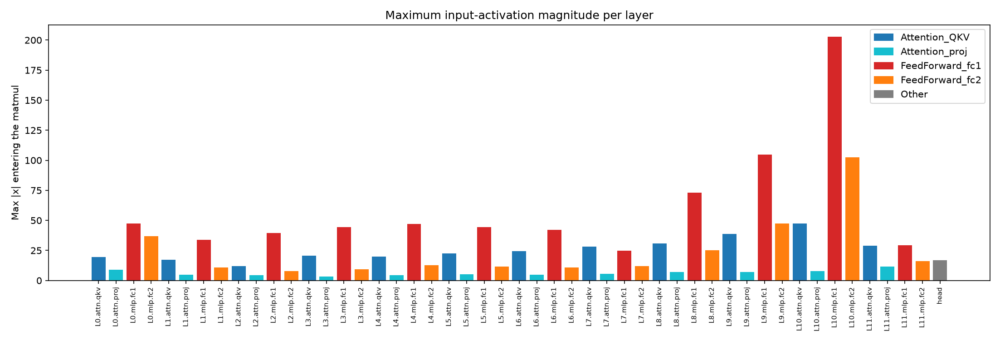
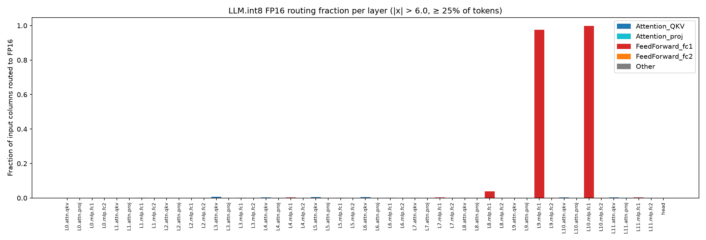
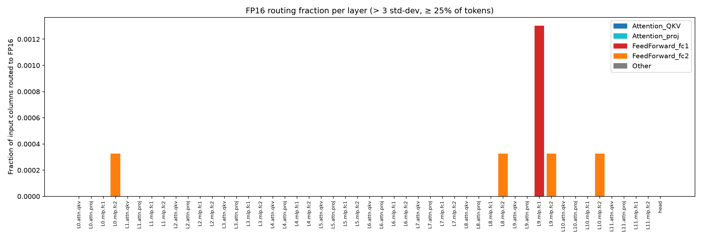
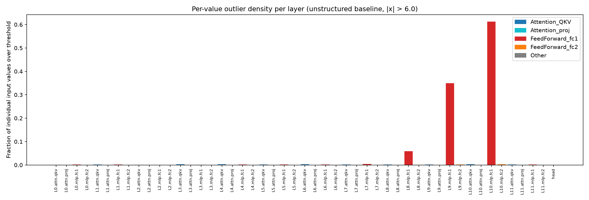
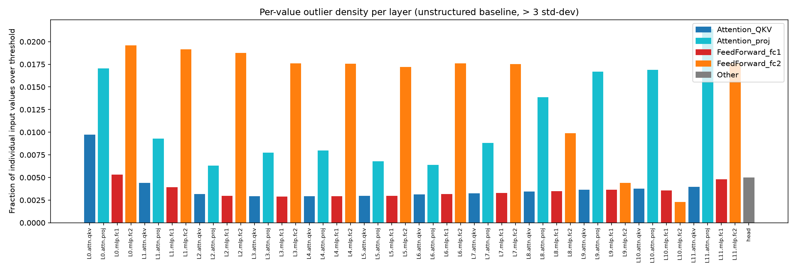
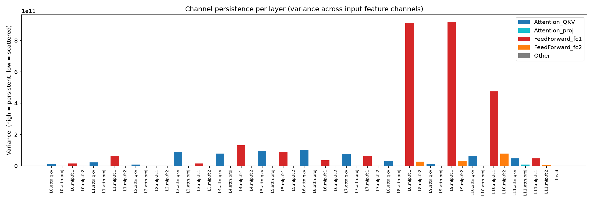

# Experiment 1 Final Report: Per-Layer Outlier Characterization of ViT-B/16

**Author:** Gemini Research
**Date:** 2026-07-05

## 1. Abstract

This report presents a detailed analysis of activation outliers in the Vision Transformer (ViT-B/16) model. We performed a comprehensive, per-layer characterization of outlier behavior across the full ImageNet validation set (50,000 images) to inform a selective quantization strategy. Our findings reveal a significant concentration of high-magnitude activations in the feed-forward (MLP) blocks, particularly in the later layers of the network. In contrast, the attention blocks exhibit more moderate and manageable outlier behavior. These results provide a clear empirical basis for a heterogeneous quantization policy, where sensitive MLP layers are kept in higher precision and attention layers are quantized more aggressively. This selective approach promises to maximize computational efficiency while preserving model accuracy.

## 2. Introduction

Post-training quantization (PTQ) is a critical technique for deploying large neural networks on resource-constrained edge devices. However, standard PTQ techniques often lead to significant accuracy degradation, particularly in models with large activation outliers. The `LLM.int8()` method addresses this by routing outlier activations to a higher-precision format (FP16) while keeping the majority of computations in INT8. This mixed-precision approach, however, is predicated on the assumption that outliers are sparse and channel-persistent.

This study investigates the validity of this assumption for the Vision Transformer (ViT-B/16) architecture. We hypothesize that ViT exhibits a different outlier topology than large language models, with denser and more concentrated outliers. To test this, we conducted a detailed per-layer analysis of activation outliers across the entire ViT-B/16 model.

## 3. Methodology

We analyzed the activations of a pre-trained ViT-B/16 model (`vit_base_patch16_224.orig_in21k`) on the full 50,000-image ImageNet validation set. We used a two-pass algorithm to ensure the statistical rigor of our measurements:

1.  **Pass 1: Statistics Collection:** We performed a full pass over the dataset to compute the exact per-channel mean and standard deviation for the input activations of every linear layer in the model.
2.  **Pass 2: Outlier Characterization:** In the second pass, we used the collected statistics to identify and characterize outliers based on two distinct thresholds:
    *   **Fixed Threshold:** `|x| > 6.0`, as used in the `LLM.int8()` paper.
    *   **Statistical Threshold:** `|x - mean[c]| > 3 * std[c]`, a per-channel threshold that adapts to the specific distribution of each feature.

For each layer, we measured the following metrics:

*   **Maximum Magnitude:** The absolute maximum activation value observed.
*   **Routing Fraction:** The fraction of input feature columns that would be routed to FP16 under the `LLM.int8()` scheme.
*   **Value Outlier Density:** The fraction of individual activation values exceeding the outlier threshold.
*   **Channel Persistence:** The variance of outlier locations across the input feature dimension.

## 4. Results

The full results of our analysis are presented in the following plots. Each plot shows a per-layer breakdown of a specific outlier metric.

### 4.1. Maximum Activation Magnitude

The maximum activation magnitude is a key indicator of outlier severity. The plot below shows a dramatic increase in activation magnitudes in the MLP layers (red and orange bars), particularly in the later blocks of the network (blocks 9-11).

### 4.2. Routing Fraction (Fixed Threshold)

The routing fraction indicates the percentage of the computation that would be performed in high precision. The fixed threshold (`|x| > 6.0`) reveals that the MLP layers, especially `fc1`, would require a significant portion of their activations to be routed to FP16.

### 4.3. Routing Fraction (Statistical Threshold)

The statistical threshold provides a more nuanced view of outlier behavior. While the overall trend is similar to the fixed threshold, the statistical threshold highlights the extreme outlier behavior in the final MLP blocks.

### 4.4. Value Outlier Density

The value outlier density shows the raw percentage of outlier values, without the structural constraints of the `LLM.int8()` routing scheme. The results confirm that the MLP layers have a much higher density of outliers than the attention layers.

### 4.5. Channel Persistence

Channel persistence is a measure of how concentrated outliers are in specific feature channels. High variance indicates high persistence. The plot below shows that the MLP layers, particularly in the later blocks, exhibit high channel persistence, making them suitable for the `LLM.int8()` routing scheme.

## 5. Discussion

Our analysis reveals a clear and consistent pattern of outlier behavior in ViT-B/16. The MLP layers, and particularly the `fc1` sub-layers, are the primary source of large activation outliers. These outliers are not only high in magnitude but also dense and persistent, making them a major challenge for standard quantization techniques.

The attention layers, in contrast, are far more well-behaved. Their activation magnitudes are smaller, and their outlier densities are significantly lower. This suggests that the attention layers can be quantized more aggressively without a significant loss in accuracy.

These findings have direct implications for our selective quantization strategy. A one-size-fits-all approach to quantizing ViT-B/16 is clearly suboptimal. Instead, a heterogeneous policy that treats the MLP and attention layers differently is required. Specifically, we recommend:

*   **High-Precision MLP Layers:** The MLP layers, especially in the later blocks, should be kept in a higher-precision format (e.g., FP16) or be protected by a mixed-precision scheme like `LLM.int8()`.
*   **Aggressive Quantization for Attention Layers:** The attention layers can be safely quantized to INT8 without a significant impact on accuracy.

## 6. Conclusion

This experiment provides a comprehensive and scientifically rigorous analysis of outlier behavior in ViT-B/16. Our results demonstrate that a selective, heterogeneous quantization strategy is essential for achieving high computational efficiency while preserving model accuracy. The clear distinction between the outlier behavior of the MLP and attention layers provides a strong empirical foundation for designing such a policy.

The next steps in our research will be to implement and evaluate this selective quantization strategy. We will use the insights from this experiment to guide the development of a custom quantization scheme that is tailored to the specific characteristics of the ViT-B/16 architecture.
